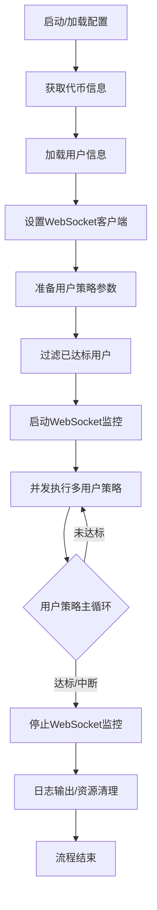

# 多用户自动化交易系统流程说明

## 1. 启动与初始化

- **加载配置**  
  读取全局和用户配置（如币种、滑点、买入金额、目标总额等），支持命令行参数和配置文件。
- **获取代币信息**  
  通过接口或本地方法获取目标交易币种的详细信息。
- **加载用户信息**  
  获取所有需要参与策略的用户及其认证信息（headers/cookies）。
- **设置 WebSocket 客户端**  
  用于行情和订单推送，注册认证信息。

---

## 2. 策略参数准备与过滤

- **生成每个用户的策略参数**  
  合并全局和个性化参数，生成每个用户的策略配置。
- **过滤已达标用户**  
  查询每个用户的历史订单，若买入总额已达目标则跳过，否则加入执行队列。

---

## 3. 启动监控与策略执行

- **启动 WebSocket 监控**  
  订阅行情和订单推送，实时获取价格和订单状态。
- **并发执行多用户策略**  
  为每个用户创建策略实例（如 LoopLimitStrategy），并发运行，监听 stop_flag 实现优雅中断。

---

## 4. 策略主循环（每个用户）

- **等待价格推送**  
  通过 WebSocket 获取最新价格。
- **循环下单**  
  计算剩余目标，分批下单（买入+卖出），每批支持递增滑点、部分成交、撤单重试。
- **订单状态监控**  
  监听订单推送或主动查询，判断是否完全成交、部分成交或未成交。
- **达标判断**  
  每轮后检查买入总额，达标则退出，否则继续。
- **支持外部中断**  
  全局或单用户 stop_flag 可随时中断策略。

---

## 5. 结束与清理

- **停止 WebSocket 监控**  
  关闭所有行情和订单推送连接。
- **日志输出与资源清理**  
  输出执行日志，清理任务和状态。
- **流程结束**  
  所有用户达标或被中断后，系统流程结束。

---

## 伪代码流程

```python
# 1. 启动与初始化
load_config()
token_info = get_token_info()
users = load_users()
ws_client = setup_ws_client(users[0])

# 2. 参数准备与过滤
user_params = prepare_user_params(users, token_info)
filtered_params = filter_users_by_target(user_params)

# 3. 启动监控与执行
ws_client.start_monitoring(tokens)
executor.run_all_strategies(ws_client, state_manager, filtered_params)

# 4. 策略主循环（每用户）
for user in filtered_params:
    while not 达标 and not stop_flag:
        下单（递增滑点、重试、撤单、部分成交）
        检查买入总额

# 5. 结束与清理
ws_client.stop_monitoring()
log("流程结束")
```

---

## 关键执行逻辑说明

### 并发调度
- `StrategyExecutor` 为每个用户创建独立的策略实例，异步并发运行。
- 支持全局和单用户优雅停止。

### 下单与重试
- 每轮下单采用递增滑点（如每次+0.2%，最多5次），每次下单后等待成交（2秒超时）。
- 若部分成交则撤单剩余部分并重试，完全成交则进入下一步。

### 订单监控
- WebSocket 实时推送订单状态，策略根据推送或主动查询判断订单是否成交。

### 达标与退出
- 每轮后检查买入总额，达标则退出当前用户策略，否则继续循环。
- 全部用户达标或被中断后，系统流程结束。

---

## 流程图

